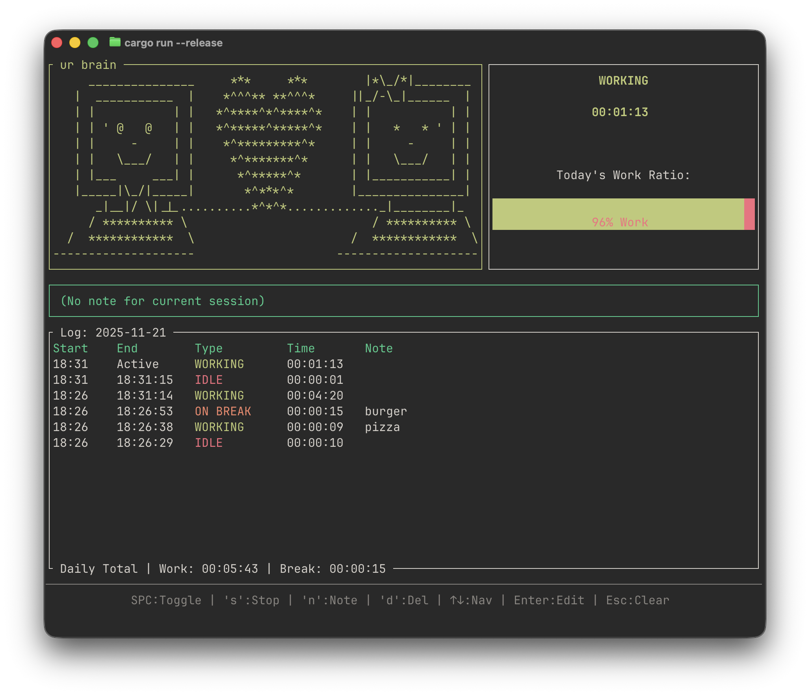

# Rust Pet Timer 🦀 🐶




A terminal-based work timer with a retro computer pet companion. Tracks your Work vs Break sessions, saves your history to JSON, and helps you stay productive with visual feedback.

## Features

*   **Computer Companion**: Animated ASCII art that reacts to your state (Working/Break/Idle).
*   **Work/Break Tracking**: Logs every session with start/end times.
*   **Daily Analytics**: Visual Gauge showing your Work vs Break ratio for the day.
*   **Persistence**: Automatically saves logs to `work_log.json`.
*   **Note Taking**: Add context to any session ("API Integration", "Lunch", etc).
*   **History Editor**: Browse past days and edit old notes.

## Controls

| Key | Action |
| :--- | :--- |
| **Space** | Toggle between **Working** and **Break** |
| **s** | **Stop** (Idle mode - pauses tracking) |
| **n** | Add/Edit **Note** for current session |
| **d** | **Delete** selected history entry |
| **Arrow Up/Down** | Select history entry |
| **Arrow Left/Right** | Change Day (View past history) |
| **Enter** | Edit Note for *selected* history entry |
| **Esc** | Clear selection / Cancel editing |
| **q** | Quit |

## Installation

1.  Ensure you have Rust installed.
2.  Clone the repo.
3.  Run:
    ```bash
    cargo run --release
    ```
