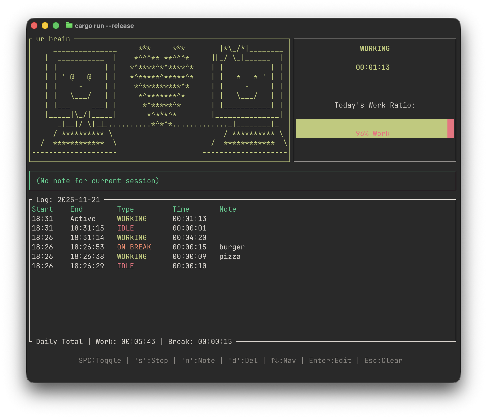

# Hamba Timer 🦀 🐶



A terminal-based work timer with a retro computer pet companion — and an MCP server so your AI agent can see what you're up to during the workday and talk back through the pet.

## Features

*   **Computer Companion**: Animated ASCII art that reacts to your state (Working/Break/Idle), with a mood (focused / happy / tired / sleepy) derived from your work-break balance.
*   **Work/Break Tracking**: Logs every session with start/end times. Sessions close honestly on quit — no inflated durations.
*   **Journal**: Press `n` anytime to log what you're doing in a proper multi-line editor. Entries are timestamped, so your day reads as a timeline.
*   **Views**: `Tab` cycles the bottom panel — History table ▸ Journal timeline ▸ weekly Stats (7-day bar chart, streak, averages).
*   **Agent Integration (MCP)**: `hamba_timer serve` runs a stdio MCP server. Your agent can poll live status, today's summary, history, and weekly stats — and send you messages that pop up as speech bubbles from the pet.
*   **Persistence**: Data lives in your platform data dir (`~/Library/Application Support/pet-timer/` on macOS), written atomically. A legacy `./work_log.json` is migrated automatically on first run.

## Controls

| Key | Action |
| :--- | :--- |
| **Space** | Toggle between **Working** and **Break** |
| **s** | **Stop** (Idle mode - pauses tracking) |
| **n** / **j** | Open the **journal** popup — type and hit Enter to log a timestamped entry (stays open, chat-style); Alt+Enter for a newline, Esc to close |
| **Tab** | Cycle bottom view: History ▸ Journal ▸ Stats |
| **m** | Dismiss agent **message** bubble |
| **r** | **Resume** the selected block — undo accidental toggles: `d` the junk blocks, then `r` your real block to continue it (today only) |
| **d** | **Delete** selected history entry |
| **Arrow Up/Down** | Select history / journal entry |
| **Arrow Left/Right** | Change Day (View past history) |
| **Enter** | Add journal entry to *selected* history session |
| **Esc** | Clear selection / Cancel editing |
| **q** | Quit |

## Installation

1.  Ensure you have Rust installed.
2.  Clone the repo.
3.  Run:
    ```bash
    cargo run --release        # try it
    cargo install --path .     # install (needed for the agent integration)
    ```

## Agent integration

The MCP server reads the same data files the TUI writes, so it answers correctly whether or not the TUI is open (a heartbeat in `status.json` tells it which). Tools:

| Tool | What the agent gets |
| :--- | :--- |
| `get_current_status` | Live state, mood, session elapsed, today totals, latest journal entry |
| `get_today_summary` | Totals, ratio, session count, full journal timeline |
| `get_history` | One day's sessions in detail, or per-day summaries over a range |
| `get_weekly_stats` | 7-day bars, streak, week total, best day |
| `send_message` | Shows a speech bubble from the pet in the TUI (read receipts via status) |

Example config for [Hermes](https://hermes-agent.nousresearch.com/docs) — in `~/.hermes/config.yaml`, or `~/.hermes/profiles/<name>/config.yaml` if you use profiles (profile configs are standalone; the root config is NOT inherited, so register the server in the config of the profile that should see it):

```yaml
mcp_servers:
  hamba_timer:
    command: /Users/you/.cargo/bin/hamba_timer
    args: [serve]
    tools:
      prompts: false
      resources: false
```

If your config defines `platform_toolsets` allowlists, also add `hamba_timer` to each platform that should expose the tools (e.g. under `platform_toolsets.cli` and `platform_toolsets.telegram`) — Hermes gates MCP servers per platform by server name.

Any MCP-capable client (Claude Code, etc.) can connect the same way: command `hamba_timer`, args `["serve"]`, stdio transport.
