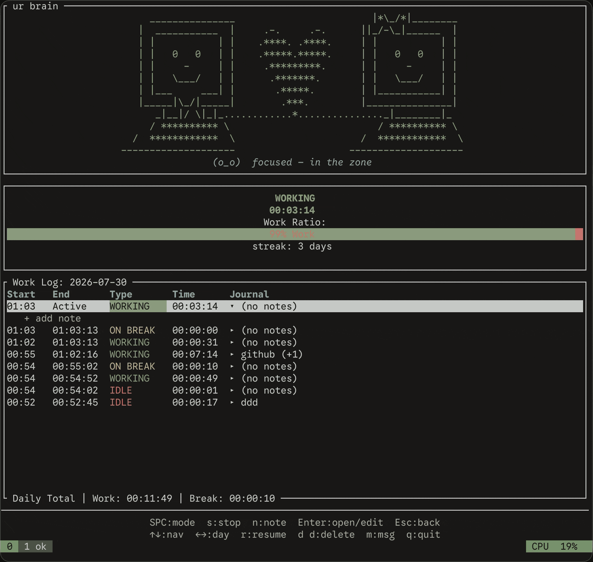

# hamba timer



a little terminal timer with a pet, work/break tracking, and notes.

## run

```sh
cargo run --release
```

or install it:

```sh
cargo install --path .
hamba_timer
```

## keys

`space` work/break · `s` stop · `n` note · `enter` open/edit
`↑↓` move · `←→` day · `r` resume · `dd` delete · `q` quit

## agent mode

```sh
hamba_timer serve
```
